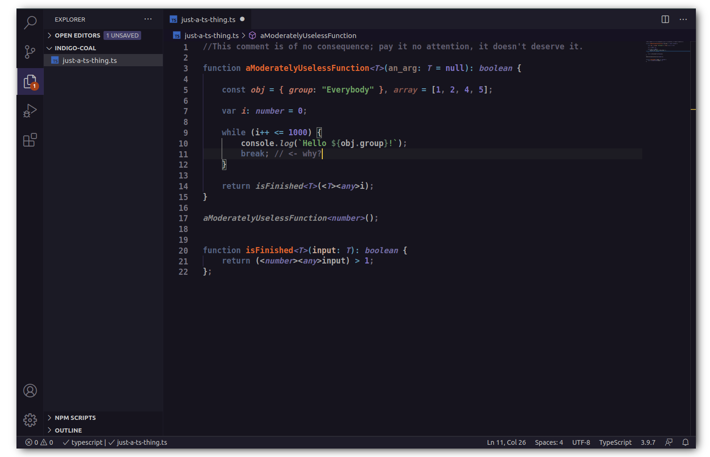

<h3 align=center> Color Theme </h3>

----

 

A dark theme that's easy on the eyes and highlights the most important bits. 

Common language symbols structures - such as `let`, `class` and `function` - are pushed to the background and references, types, literals, and declarations are 
pulled forward to make it easier to focus on core information. 

### Features

- Lower intensity colors for your viewing pleasure.
<!--
- Color specific to language constructs:
    - <b>Purple</b>: Types and Literals
    - <b>Light Orange</b>: Declarations and object literals
    - <b>Dark Orange</b>: Function Names
    - <b>Green</b>: Strings
    - <b>Light Grays</b>: Variables, Members, and Calls
-->

- Labeled theme file for easy modification

- Tuned Language Support for the following languages:
    - JavaScript
    - TypeScript
    - Python
    - HTML
    - CSS
    - C++
    - JSON

#### Repository

[github](https://github.com/acweathersby/indigo-coal) 

